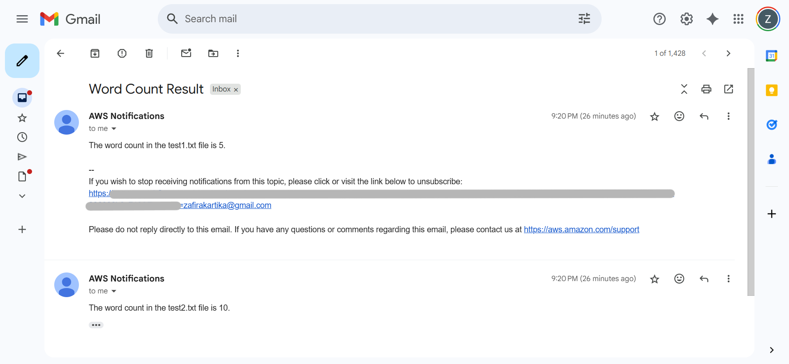

# Serverless File Processing and Notification System on AWS

An automated, event-driven workflow to analyze text files using AWS Lambda, triggered by S3 uploads, with results delivered via SNS email notifications.


### Project Overview

This project demonstrates a practical serverless data processing pipeline built entirely on Amazon Web Services. The system automatically ingests text files uploaded to cloud storage, processes them to count the number of words, and sends a formatted report to a designated email address. This project showcases the power of event-driven architecture to create efficient, scalable, and cost-effective solutions without managing any servers.


### AWS Architecture

The solution uses a combination of AWS services, where each service performs a specific, crucial role in the workflow. When a `.txt` file is uploaded to the S3 bucket, it automatically triggers the Lambda function, which processes the file and sends a notification via SNS.


### Services Used

**Amazon S3:** Used as the storage layer and the event source. An event notification was configured to trigger AWS Lambda upon the creation of any `.txt` object.

**AWS Lambda:** The core of the application's logic. The Python function is responsible for retrieving the file, counting the words, and formatting the result message.

**Amazon SNS:** Served as the notification service. The Lambda function publishes the result to an SNS topic, which then delivers a formatted email to subscribed endpoints.

**AWS IAM:** An IAM role was used to grant the Lambda function the specific permissions needed to read from S3 and publish to SNS, following security best practices.

**Amazon CloudWatch:** All logs from the Lambda function were sent to CloudWatch, which was essential for testing and debugging.


### Project in Action: Showcase

#### 1. File Upload to S3
A text file is uploaded to the source S3 bucket.


#### 2. Lambda Trigger & Execution
The S3 upload event triggers the `WordCountFunction`, which runs the Python code. The logs in CloudWatch confirm a successful execution.


#### 3. Final Email Notification
The user receives a formatted email, sent via SNS, containing the word count result.




### Code

The core logic is contained in the Python function below, which uses the Boto3 library to interact with AWS services.

*See the full script here: [code/word_count_function.py](./code/word_count_function.py)*

```python
import json
import boto3
import os

# Initialize the S3 and SNS clients
s3_client = boto3.client('s3')
sns_client = boto3.client('sns')

# Retrieve the SNS Topic ARN from an environment variable
SNS_TOPIC_ARN = os.environ['SNS_TOPIC_ARN']

def lambda_handler(event, context):
    """
    This function is triggered by an S3 event. It reads a text file,
    counts the words, and sends the result to an SNS topic.
    """
    try:
        # 1. Get the bucket and file name from the S3 event trigger
        s3_event = event['Records'][0]['s3']
        bucket_name = s3_event['bucket']['name']
        file_name = s3_event['object']['key']

        # 2. Download the file content from S3
        response = s3_client.get_object(Bucket=bucket_name, Key=file_name)
        file_content = response['Body'].read().decode('utf-8')

        # 3. Count the words and format the notification message
        word_count = len(file_content.split())
        subject = "Word Count Result"
        message = f"The word count in the {file_name} file is {word_count}."

        # 4. Publish the message to the SNS topic
        sns_client.publish(
            TopicArn=SNS_TOPIC_ARN,
            Subject=subject,
            Message=message
        )

        return {
            'statusCode': 200,
            'body': json.dumps(f"Successfully processed {file_name} and sent notification.")
        }

    except Exception as e:
        print(f"Error processing file: {e}")
        raise e
